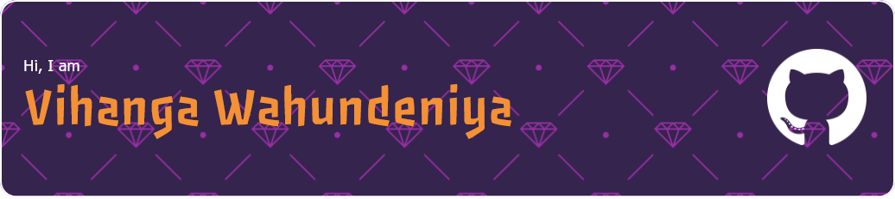

🎓 Undergraduate specialized in Software Engineering @ SLIIT.  
💻 Dabbling in Full Stack Development, learning with every bug and commit.  
🎮 Experimenting with game development because why limit chaos to just web apps?

## 💻 Tech Stack
#### 🎨 Frontend Development
        
#### 🎨 Styling & UI
  
#### ⚙️ Backend Development
   
#### 🗄️ Databases
  
#### 🖥️ Programming Languages
    
#### 🧪 Testing
  

---

## 📊 GitHub Analytics

  

---

## 📈 Contribution Activity

---

## 🏆 GitHub Achievements

  

---

## 🌐 Connect With Me

     

---

### 💭 Quote of the Day

 

### 🎵 What I'm playing now...

 

### 🎧 Recently Played

 

**⭐ From [ViiHAA](https://github.com/ViiHAA) with ❤️**

